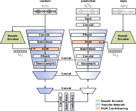
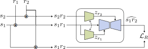

# CWUNET

This repository contains the code for the neural acoustic matching approach presented in the paper: 
*Conditioned Wave-U-Net for Acoustic Matching of Speech in Shared XR Environments*

  
  
  

**Problem formulation:**

The goal of our approach is to modify the properties of the *content* speech signal $s_1r_1$ so that it sounds as if it originated from the acoustic space characterized by the *style* speech signal $s_2r_2$, i.e. to estimate the reverberant *target* signal $s_1r_2$, given two input signals $s_1r_1$ and $s_2r_2$. 

**Generating a database of synthetic impulse responses:**

Our dataset contains speech convolved with synthetically generated RIRs. The procedure to generate RIRs is availble in the notebook `rir_dataset_1.ipynb`. We generate one mono RIR per randomly generated shoebox room using a fixed source-receiver distance. We use MASP python package for RIR synthesis. 

**Generating metadata for training:**

We convolve speech samples with RIRs during training - this way we can use the same data to generate various pairs of content and style speech. Before training, we generate a csv file with list of such pairs. It is used by the dataloader. The generation of the metadata for training is available in the notebook `dataset_prepare_metadata_1.ipynb`.

**Dataset class:**

The dataset class (`src/dataset.py`) uses the list of predefined combinations of speech and RIRs. It loads the speech and RIR signals, randomly cuts the non-silent speech excerpts and convolves speech with RIRs. A datapoint loader outputs content speech, style speech, target speech and anechoic speech signals. 

**Models:**

Our approach constists of two main networks: the *Reverb Encoder* network and the *Transfer* network, conditioned on the embedding from the Reverb Encoder. In the paper we use encoder from FINS [1] for the Reverb Encoder, Wave-U-Net with FiLM layers as the conditioned Transfer network. Model definitions are provided in the file `src/models.py`. 

**Training:**

We use standard supervised training scheme. The training procedure is available in the file `src/trainer.py`. To run training experiments with various parameter combinations, we use the file `src/runexp.py`. 

**Evaluation**

About evaluation..

**Configuration**

Most classes are initialized with a yaml config file (`config/basic.yaml`), which contains all necessary parameters.

**Audio demo**

Please visit [this website](https://joaluba.github.io/CWUNET-demo/) to listen to audio samples generated by the approach.
